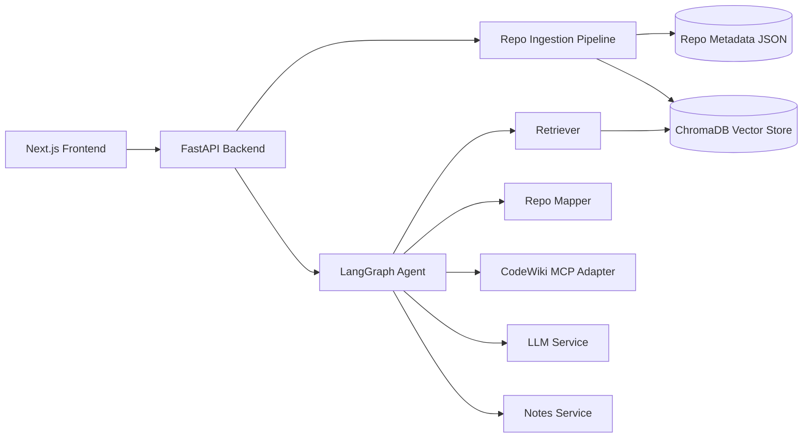
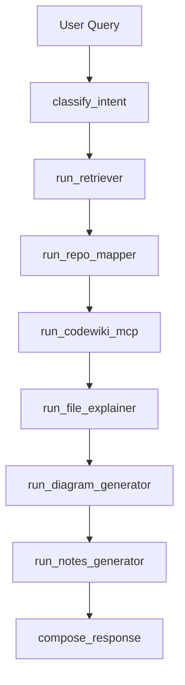
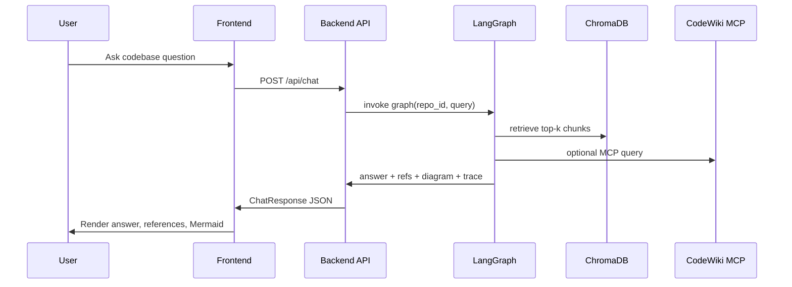

# CodeSight AI

CodeSight AI is a production-style full-stack application for exploring unfamiliar GitHub repositories with agentic AI.
It combines local RAG over cloned source code with MCP-powered external repo intelligence (CodeWiki), then returns grounded answers, file references, Mermaid diagrams, and onboarding notes.

## Features

- Public GitHub repo ingestion and indexing
- Code-aware chunking with language and symbol metadata
- Embeddings + vector search with ChromaDB
- Agentic orchestration with LangGraph
- MCP integration layer for CodeWiki with graceful fallback
- Mermaid diagram generation + UI rendering
- Structured learning notes (onboarding, architecture, auth-flow, api-flow, key-modules)
- Grounded references (file path + line ranges)
- Premium motion-first frontend (landing + workspace transitions)
- Dedicated 3D Notes reader route with page-turn interaction (`/notes/{repo_id}`)
- Dockerized backend and frontend

## Tech Stack

- Backend: FastAPI, LangChain, LangGraph, ChromaDB, sentence-transformers, GitPython, Pydantic
- Frontend: Next.js 14, TypeScript, Tailwind CSS, Radix UI primitives, Mermaid
- Infra: Docker, docker-compose, Makefile

## Monorepo Structure

```text
codesight-ai/
  backend/
    app/
      api/
      agent/
      core/
      ingestion/
      retrieval/
      mcp/
      prompts/
      services/
      tools/
      models/
      utils/
      main.py
    tests/
    pyproject.toml
    Dockerfile
    .env.example
  frontend/
    app/
    components/
    hooks/
    lib/
    public/
    types/
    Dockerfile
    package.json
  docker-compose.yml
  Makefile
  README.md
```

## Architecture



## Agent Workflow



## Request Flow



## API Endpoints

- `POST /api/repos/ingest`
- `GET /api/repos/{repo_id}`
- `POST /api/chat`
- `POST /api/notes/generate`
- `GET /api/notes/{repo_id}`
- `GET /api/health`

## Environment Variables

### Backend (`backend/.env`)

Copy from `backend/.env.example`.

Key values:

- `LLM_API_KEY`: OpenAI-compatible API key
- `LLM_API_BASE`: OpenAI-compatible endpoint
- `LLM_MODEL`: model id
- `MCP_ENABLED`: enable/disable CodeWiki integration
- `MCP_CODEWIKI_ENDPOINT`: MCP server endpoint
- `EMBEDDING_MODEL_NAME`: sentence-transformers model

### Frontend (`frontend/.env`)

Copy from `frontend/.env.example`.

- `NEXT_PUBLIC_API_BASE_URL=http://localhost:8000`

## Local Development

### Backend

```bash
cd backend
cp .env.example .env
python -m venv .venv
# On Windows:
.\.venv\Scripts\activate
# On Linux/macOS:
# source .venv/bin/activate
python -m pip install -e .[dev]
python -m uvicorn app.main:app --reload --host 0.0.0.0 --port 8000
```

### Frontend

```bash
cd frontend
cp .env.example .env
npm install
npm run dev
```

Frontend runs at `http://localhost:3000`.

Main UI routes:

- `/` landing + ingest
- `/workspace/{repo_id}` chat workspace
- `/notes/{repo_id}` premium 3D notes reader

## Run with Docker

```bash
cp backend/.env.example backend/.env
cp frontend/.env.example frontend/.env
docker-compose up --build
```

- Backend: `http://localhost:8000`
- Frontend: `http://localhost:3000`

## Tests

```bash
cd backend
pytest -q
```

Covered test areas:

- GitHub repo URL validation
- file filtering rules
- chunking behavior
- retrieval pipeline pass-through
- chat response schema typing
- MCP fallback handling

## Example Prompts

- "Explain how authentication works and cite files"
- "Give me the request flow from API route to database"
- "Create an onboarding path for a new engineer"
- "Generate architecture notes for key modules"

## UI Screenshots

Add screenshots to `frontend/public/screenshots/` and reference them here:

- `landing.png`
- `workspace-chat.png`
- `workspace-diagram.png`

## Operational Notes

- If `LLM_API_KEY` is missing, backend uses deterministic fallback text where possible.
- If CodeWiki MCP is unavailable, chat still works with local RAG-only path.
- Repositories and vectors persist under `backend/data/`.

## Future Improvements

- SSE streaming chat responses
- richer dependency graph extraction via tree-sitter + static analysis
- RBAC and multi-user workspaces
- async background ingest jobs with progress polling
- reranker model for improved retrieval precision
