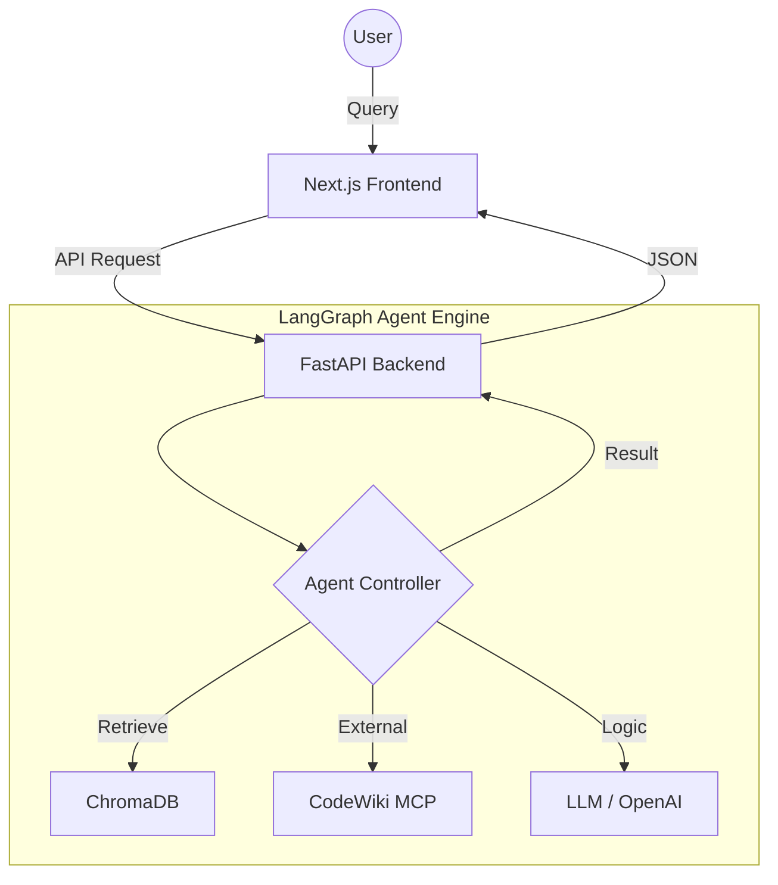
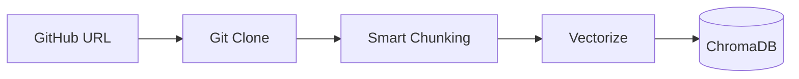

# CodeSight AI: Comprehensive Study Guide & Presentation Script

This document is your ultimate resource for the **CodeSight AI** minor project. it includes a detailed technical deep-dive, a slide-by-slide presentation script, and visual diagrams.

---

## Part 1: Detailed System Working

### 1. The Core Engine: LangGraph
Unlike traditional linear AI chains, CodeSight AI uses **LangGraph**. This allows the agent to:
- **Loop**: It can go back and fetch more code if the first search wasn't enough.
- **State Management**: It remembers what it found in previous steps.
- **Node-Based Logic**: Each part of the brain (retriever, diagrammer, explainer) is a separate node.

### 2. Semantic Search (RAG)
- **Vector Embeddings**: We convert code into numbers (vectors) that represent their *meaning*.
- **Similarity Search**: When you ask "How does auth work?", the system looks for code vectors that are "mathematically close" to the concept of authentication.
- **ChromaDB**: This is our "memory" where all these vectors are stored.

### 3. Frontend Excellence
- **Next.js 14 App Router**: Provides high performance and SEO-friendly rendering.
- **Three.js / React Three Fiber**: Powers the **3D Notes Reader**, giving the project a premium, state-of-the-art feel.
- **Mermaid.js**: Dynamically renders architecture diagrams directly in the browser.

---

## Part 2: Presentation Script (Slide-by-Slide)

**Total Time: ~7-10 Minutes**

### Slide 1: Introduction (Title)
*"Good morning everyone. My name is Soumya, and today I am presenting **CodeSight AI**. Our project is a production-style full-stack application designed to help developers explore and understand unfamiliar GitHub repositories using Agentic AI."*

### Slide 2: The Problem
*"When developers join a new project, they often spend days just trying to understand how different modules interact. Standard search tools only look for keywords. They don't understand the 'why' or the 'how' of the code. This is the gap CodeSight AI fills."*

### Slide 3: The Solution & Core Features
*"CodeSight AI uses a technique called RAG (Retrieval-Augmented Generation). It indexes a repository locally and uses an AI agent to answer questions, generate diagrams, and even create structured onboarding notes for new engineers."*

### Slide 4: Technical Architecture (Refer to Diagram 1)
*"Our architecture consists of a Next.js frontend and a FastAPI backend. The 'brain' of the system is a LangGraph agent. It connects to ChromaDB for code retrieval and CodeWiki for external repository intelligence. This ensures every answer is grounded in the actual source code."*

### Slide 5: The Agent Workflow (Refer to Diagram 3)
*"When a query comes in, the agent first 'classifies' the intent. If you ask for a diagram, it triggers the Diagram Generator. If you ask about logic, it runs the Retriever. This multi-step reasoning allows for much higher accuracy than a simple chatbot."*

### Slide 6: Premium UI & 3D Notes
*"We didn't just build a functional tool; we built an experience. Our frontend includes a 3D Notes Reader where onboarding materials are presented in an interactive book format. This makes complex architectural notes engaging and easy to digest."*

### Slide 7: Conclusion & Future Scope
*"CodeSight AI is a step towards autonomous code intelligence. In the future, we plan to add background ingestion jobs and richer dependency graph extraction. Thank you for your time. I am now open to any questions."*

---

## Part 3: Deep-Dive Diagrams

### System Architecture

### Data Ingestion

---

## Part 4: Key Terms Glossary (For Viva)

1.  **RAG (Retrieval-Augmented Generation)**: Combining external data retrieval with LLM generation for grounded answers.
2.  **Vector Database (ChromaDB)**: A database designed to store and search mathematical representations of data (embeddings).
3.  **Agentic AI**: AI that can reason, plan, and use tools autonomously to achieve a goal.
4.  **LangGraph**: A library for building stateful, multi-actor applications with LLMs, supporting cycles and persistence.
5.  **MCP (Model Context Protocol)**: An open standard that enables seamless integration between AI models and data sources.
6.  **Mermaid.js**: A tool that converts text into diagrams (flowcharts, sequence diagrams, etc.).

---

## Part 5: Potential Viva Questions

**Q: How do you prevent the AI from making things up (Hallucinations)?**
**A:** By using Grounded RAG. We force the AI to only answer based on the code chunks retrieved from our database and we provide file references so the user can verify.

**Q: Why use FastAPI instead of Node.js for the backend?**
**A:** FastAPI is exceptionally fast for Python-based AI workflows and provides built-in support for asynchronous operations and automated documentation (Swagger).

**Q: What happens if the repository is too large?**
**A:** We use a filtering system to exclude unnecessary files like dependencies and build artifacts, focusing only on the core logic to save space and processing time.
