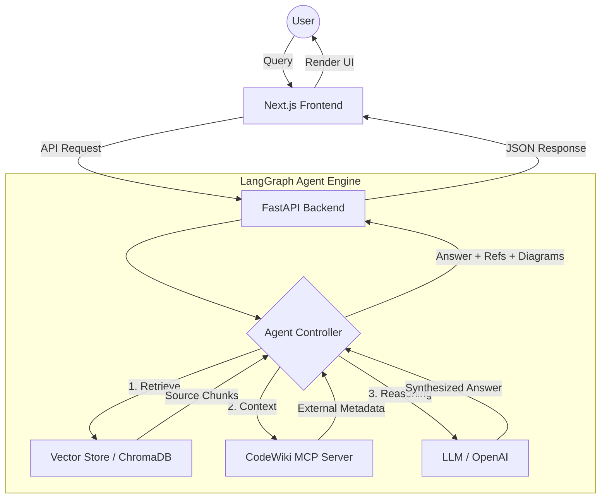
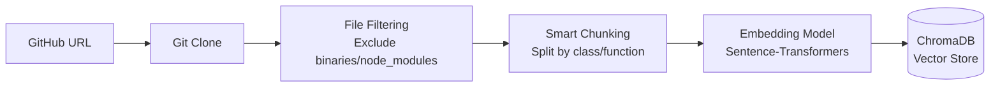
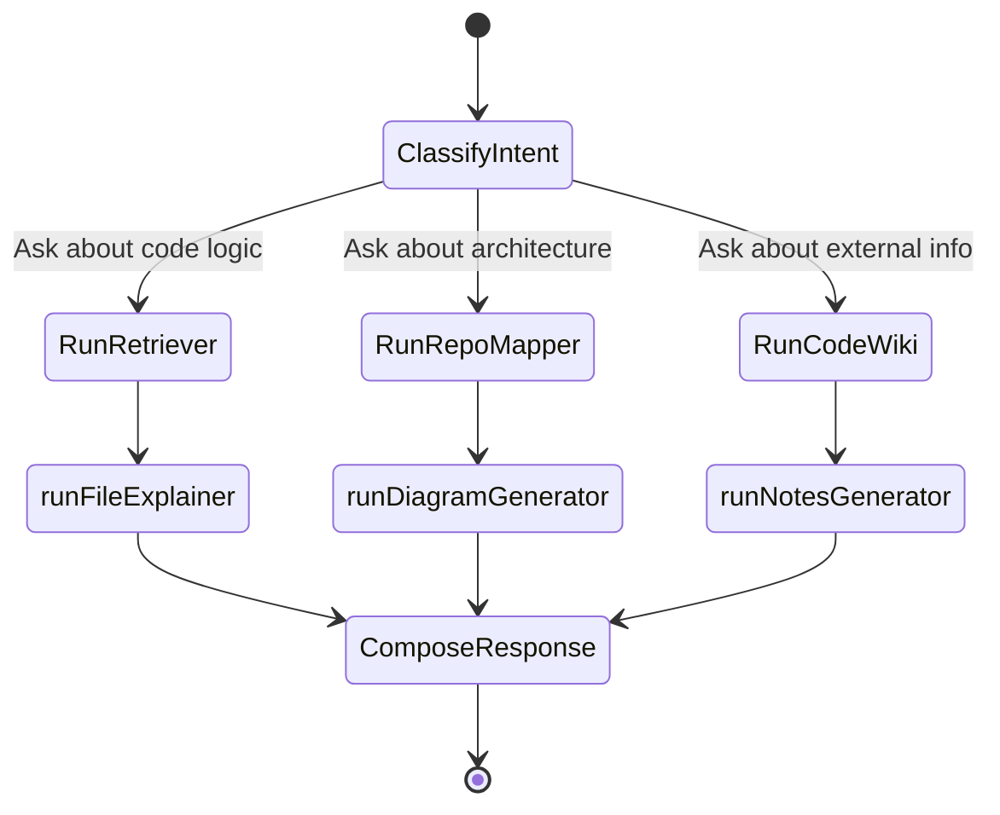

# CodeSight AI: Viva & Presentation Q&A Study Guide

This guide contains potential questions, detailed answers, and visual diagrams to help you explain the full working of **CodeSight AI** during your minor project viva.

---

## 1. High-Level Architecture (The "Big Picture")

**Q: Can you explain the end-to-end flow of a user request?**
**A:** When a user asks a question, the Next.js frontend sends it to the FastAPI backend. The backend triggers a LangGraph agent which decides whether to fetch code from ChromaDB, query the CodeWiki MCP, or generate a diagram. The final answer is synthesized and sent back with grounded references.

### System Architecture Diagram

---

## 2. Data Ingestion & RAG Pipeline

**Q: How do you prepare the source code for the AI to understand it?**
**A:** We use a pipeline that processes the repository into searchable "embeddings." This is the core of our RAG (Retrieval-Augmented Generation) capability.

### Ingestion Flow

**Q: What is "Smart Chunking"?**
**A:** Instead of splitting code by a fixed number of characters, we try to preserve the context of functions and classes. This ensures that the AI doesn't receive a half-finished code block which would lead to incorrect explanations.

---

## 3. Agent Decision Logic (LangGraph)

**Q: How does the AI decide what tools to use?**
**A:** We use a directed graph where each "node" is a specialized task. The LLM acts as the router, deciding which node to transition to based on the user's intent.

### Agentic Workflow Diagram

---

## 4. Technical Deep-Dive

**Q: What are "Grounded References"?**
**A:** It is a critical feature for trust. When the LLM provides an answer, we force it to cite the specific file path and line numbers it used. The frontend then displays these as clickable links so the user can verify the code themselves.

**Q: Explain the role of ChromaDB.**
**A:** ChromaDB is a vector database. It stores the mathematical "vectors" (embeddings) of our code chunks. When a user asks a question, we convert the question into a vector and perform a "cosine similarity search" to find the most relevant code blocks.

---

## 5. Challenges & Solutions

**Q: How do you handle large repositories with thousands of files?**
**A:**
1. **Filtering**: We ignore non-essential files (images, docs, dependencies).
2. **Top-K Retrieval**: We only send the top 5-10 most relevant chunks to the LLM to stay within the token limit.
3. **Summarization**: For very large queries, the agent first generates a summary of the relevant modules before deep-diving into specific logic.

---

## 6. Presentation Strategy (VIVA Tips)

- **Show, Don't Just Tell**: If asked about the UI, mention the **3D Notes Reader**. It shows you went beyond basic functionality to focus on UX.
- **Explain the "Agent"**: Emphasize that this isn't just a simple chatbot; it's a system that *plans* its actions using LangGraph.
- **Mention GitHub CLI**: If asked about deployment, mention that you've integrated it with GitHub for seamless version control and collaboration.
